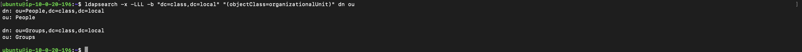
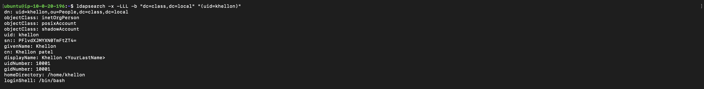

# Assignment: The Digital Phonebook (Intro to LDAP)

This project sets up a small OpenLDAP directory for the fictional domain
`class.local` (base DN: `dc=class,dc=local`). It demonstrates a
centralized "source of truth" for user accounts.

## Files

### structure.ldif
Defines the two Organizational Units (OUs) that act as "folders" inside
the directory tree:

```
dn: ou=People,dc=class,dc=local
objectClass: organizationalUnit
ou: People

dn: ou=Groups,dc=class,dc=local
objectClass: organizationalUnit
ou: Groups

```

Each OU uses the `organizationalUnit` objectClass, which is the standard
LDAP class for grouping entries.

### users.ldif
Populates `ou=People` with two user accounts. Each entry combines three
objectClasses so the user is usable across different systems:

```
dn: uid=khellon,ou=People,dc=class,dc=local
objectClass: inetOrgPerson
objectClass: posixAccount
objectClass: shadowAccount
uid: khellon
sn: <YourLastName>
givenName: Khellon
cn: Khellon <YourLastName>
displayName: Khellon <YourLastName>
uidNumber: 10001
gidNumber: 10001
userPassword: password123
homeDirectory: /home/khellon
loginShell: /bin/bash

dn: uid=testuser,ou=People,dc=class,dc=local
objectClass: inetOrgPerson
objectClass: posixAccount
objectClass: shadowAccount
uid: testuser
sn: User
givenName: Test
cn: Test User
displayName: Test User
uidNumber: 10002
gidNumber: 10002
userPassword: testpass123
homeDirectory: /home/testuser
loginShell: /bin/bash

```

The two accounts created are:
1. `uid=khellon` — my own account.
2. `uid=testuser` — a test account to confirm multiple users are
   searchable.


## Screenshots
- 1 


- 2 

## Written Response

The deletion of a user account on the LDAP server immediately blocks their access to all systems which use the server for authentication. The system automatically identifies all devices which would create dead accounts. The process of making one change at a time becomes faster and produces fewer mistakes while maintaining a detailed audit record which remains inaccessible to users who operate multiple local accounts on different computers.
