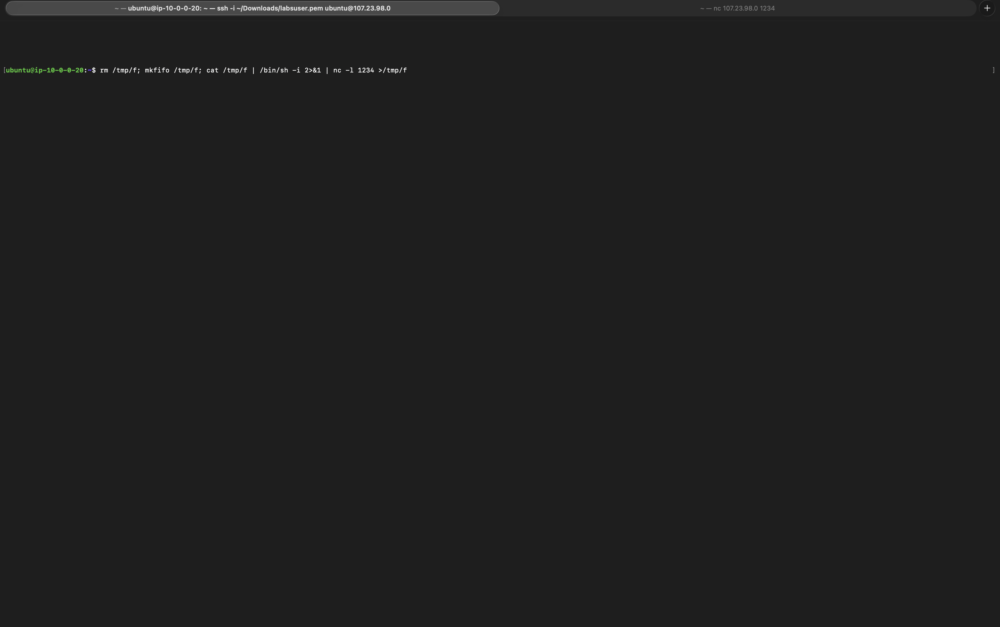
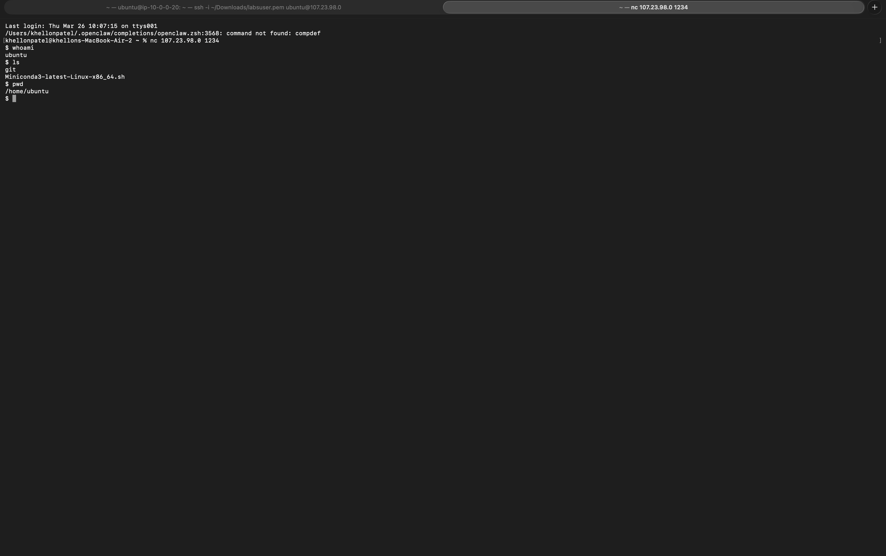
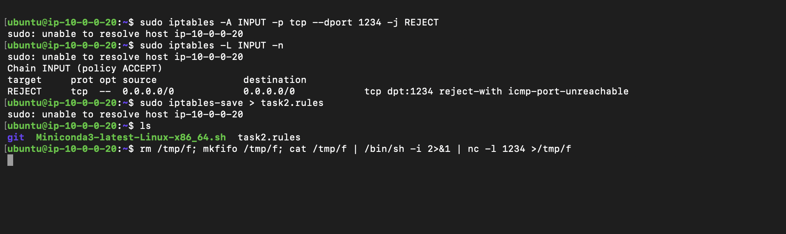
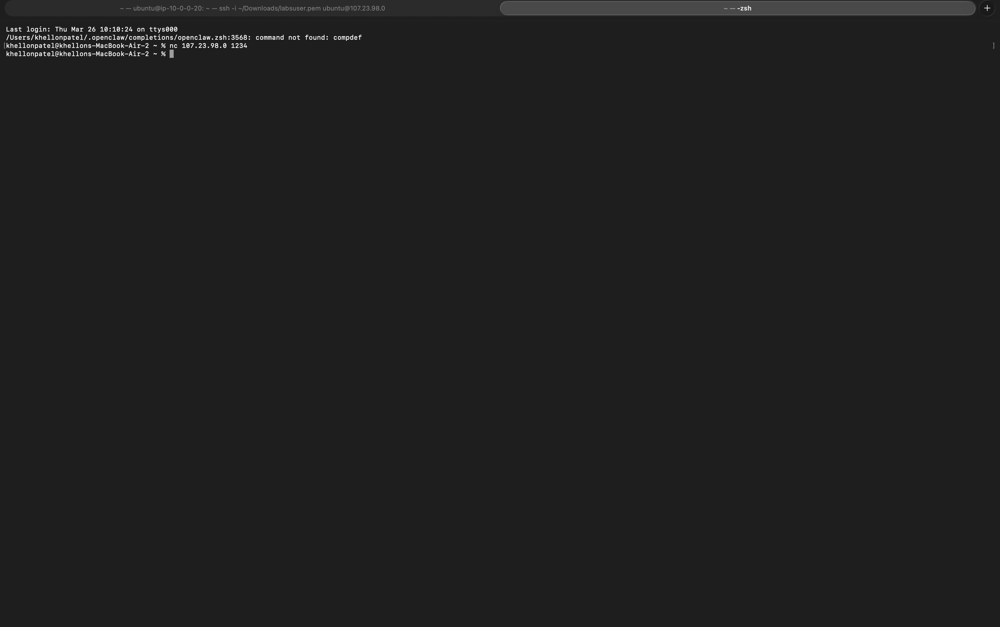

[](https://classroom.github.com/a/0FeAcfa4)

# Lab 4 : CEG 3400 Intro to Cyber Security

## Name: Khellon Patel

---

## Task 1: A Shell Game

### What port does the provided command open?

Port **1234**.

---

### What is a Bind Shell and a Reverse Shell?

* **Bind Shell:**
  The target machine opens a communication port (listener) and waits for an incoming connection. The attacker connects to the target machine’s IP address and port to gain shell access.

* **Reverse Shell:**
  The target machine initiates a connection back to the attacker’s machine. The attacker runs a listener, and the target connects outward. This is commonly used to bypass firewalls that block incoming traffic.

* **Reference:**
  https://www.geeksforgeeks.org/difference-between-bind-shell-and-reverse-shell/

---

### Which type of shell does this command open?

This command opens a **Bind Shell**. The AWS instance used:

```bash
nc -l 1234
```

This puts the system in listen mode, waiting for incoming connections.

---

### What/whose permissions does this shell provide?

It provides the permissions of the **`ubuntu`** user, since that account executed the command.

---

### Give evidence of your malicious shell running a command:

---



---

## Task 2: Iptables
---

### Would this configuration be a whitelist or blacklist? Explain.

This is a **blacklist** configuration.

The firewall allows all incoming traffic by default but explicitly blocks port **1234**.

---

### Why use the REJECT action?

`REJECT` sends a "connection refused" response immediately. This helps verify quickly that the firewall rule is working.

---

### Why NOT use the REJECT action?

It informs attackers that:

* The server exists
* A firewall is actively blocking them

Using `DROP` is more secure because it silently ignores packets.

---

### How did you verify this worked?




---



This confirmed the firewall rule was active.

---

## Task 3: Any Port in a Storm

**Reminder Deliverable:** `task3.rules`

---

### Would this configuration be a whitelist or blacklist? Explain.

This is a **whitelist** configuration.

Only port **22 (SSH)** is allowed, while all other incoming traffic is rejected.

---

### How did you verify this worked?

I tested by running:

```bash
ssh -i ~/Downloads/labsuser.pem ubuntu@107.23.98.0
```

* SSH connection succeeded ✅
* Other ports were blocked ❌

---

### Did you lock yourself out?

Yes.

After applying the `REJECT` rule, my SSH session timed out. I recovered access by:

1. Rebooting the EC2 instance via AWS Console
2. This cleared temporary iptables rules
3. I reconfigured the firewall correctly afterward

---

**End of Lab**
