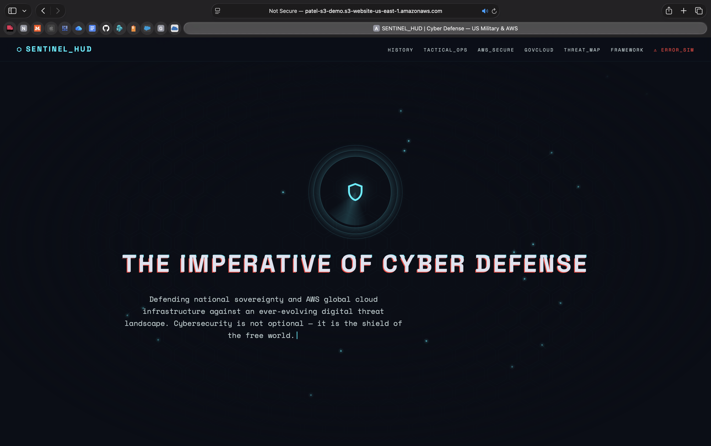

# Serverless Hosting with S3 Static Websites

## 1. The Endpoint

**S3 Static Website URL:**
`http://patel-s3-demo.s3-website-us-east-1.amazonaws.com/index.html`

---

## 2. The Bucket Policy

To allow the public internet to view the website, the following JSON bucket policy was applied:

```json id="b7n2qa"
{
    "Version": "2012-10-17",
    "Statement": [
        {
            "Sid": "PublicReadGetObject",
            "Effect": "Allow",
            "Principal": "*",
            "Action": [
                "s3:GetObject"
            ],
            "Resource": [
                "arn:aws:s3:::patel-s3-demo/*"
            ]
        }
    ]
}
```

### Policy Explanation

* **Effect:** Set to `"Allow"`, which grants the specified permission rather than restricting it
* **Principal:** Set to `"*"`, meaning anyone on the internet can access the objects (public access)
* **Action:** Set to `"s3:GetObject"`, which allows users to retrieve and read files like HTML, CSS, and JavaScript

---

## 3. Comparison: S3 vs. Apache EC2

### Advantage of S3 Hosting

S3 is a fully managed, serverless service. There is no need to maintain an operating system or web server (like Apache). It is highly available and automatically scales to handle traffic spikes.

### Disadvantage of S3 Hosting

S3 can only serve static content (HTML, CSS, client-side JavaScript, and media files). It cannot run server-side code (like PHP or Node.js) or connect directly to databases, making it unsuitable for dynamic web applications.

---

## 4. Screenshot

Below is the screenshot showing the site successfully loading via the S3 endpoint:




---

* Citations 
* **Generative AI Use**: i use Gemini Two structure my markdown file specifically using the prompt " how to add one tap copy feature in markdown file by using that user can copy code in one click " output  ` GitHub/Obsidian	Built-in (Just use ```) `

## 5. Rubric Checklist

* [x] S3 static website endpoint URL provided
* [x] JSON bucket policy shown and explained
* [x] Advantage and disadvantage of S3 vs Apache EC2 described
* [x] Screenshot showing site loading via S3 endpoint included
